# 01. Models and Deployment

## Discover Models

You can explore various AI models in the Discover section of the Foundry portal.

### Step-by-Step Guide

1. **Navigate to Discover Section**
   - Click **Discover** in the top right menu of the Foundry portal.

   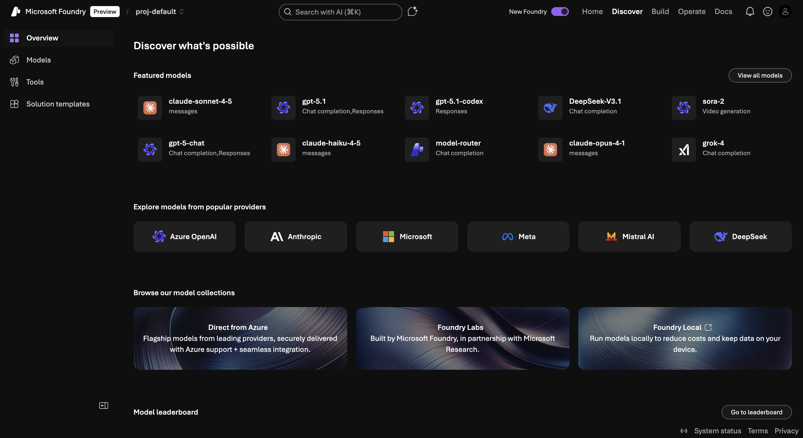

   - Select the **Models** menu.
   
   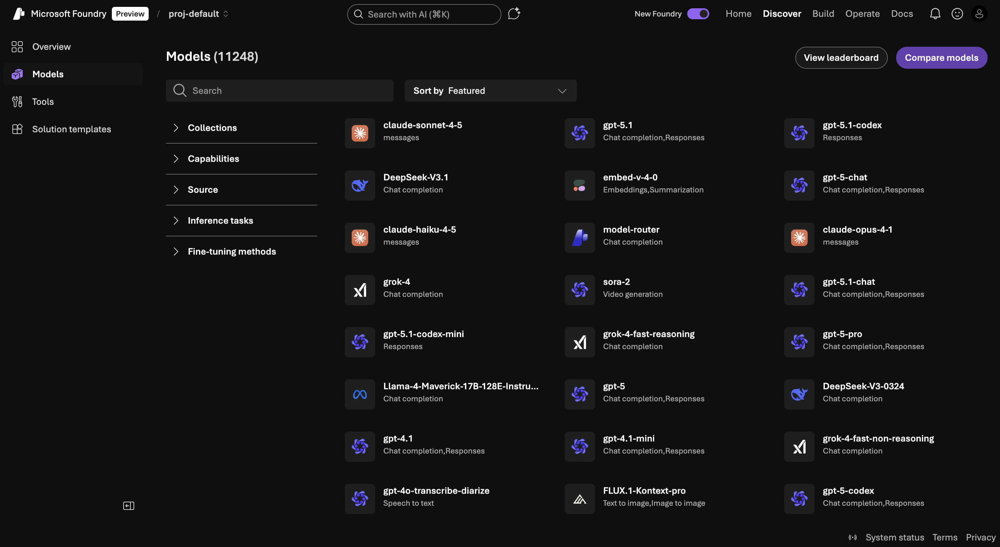


### 💡 Tips

- Check the leaderboard regularly for the latest model updates
- Review each model's capabilities and limitations on its detail page

---

## Deploy Models

### Deploy GPT-5.1 Model

1. **Use Model Comparison Feature**
   - Click the **Compare models** button on the Models page.
   - Select the models you want to compare (e.g., GPT-5.1, GPT-5, Claude 4.5 Sonnet).
   - Compare performance, cost, and features.
   
   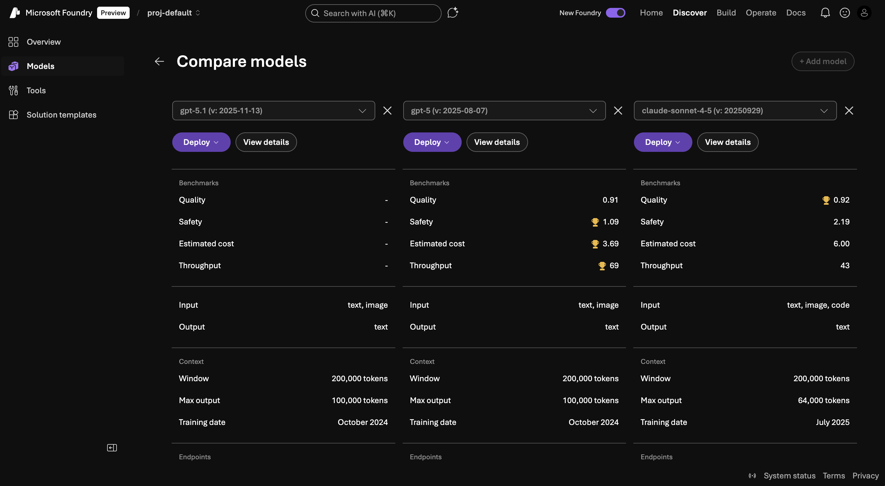

2. **Select and Deploy GPT-5.1**
   - Find **gpt-5.1** in the model list.
   - Click the model card to view detailed information.
   
   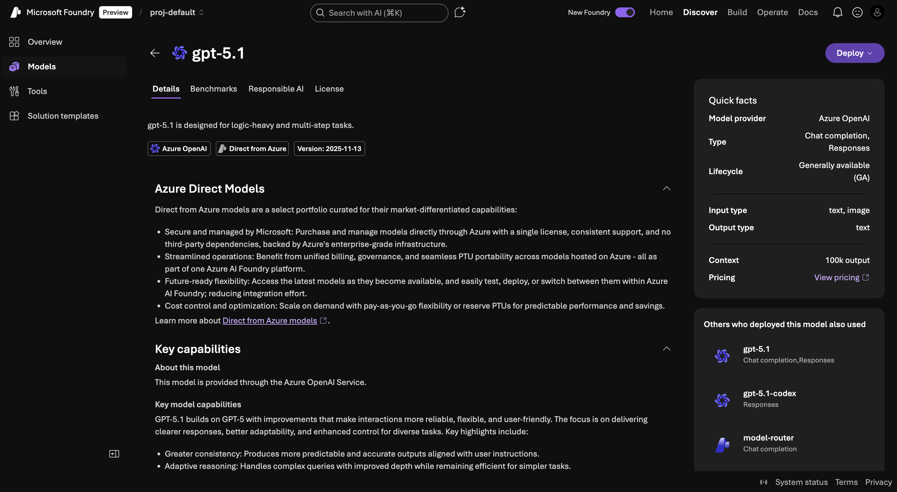

3. **Deployment Configuration**
   - Click the **Deploy** button.
   
   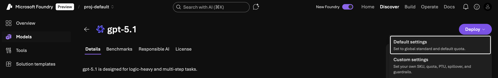

4. **Complete Deployment**
   - Click **Default settings** to start deployment.
   - Deployment takes approximately 1-2 minutes to complete.

### ✅ Verification Checklist

- Verify deployed `gpt-5.1` model in Build > Models section
- Confirm deployment status is "Succeeded"
- Check that Endpoint URL was created

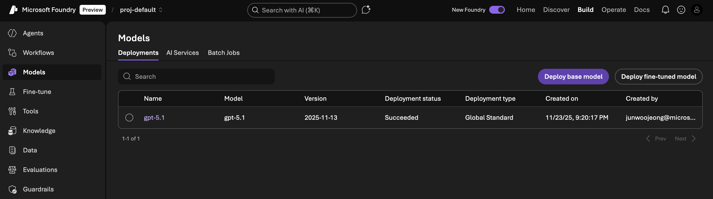


# 02. Agent Development

This module teaches you how to create and deploy AI agents with diverse capabilities and functionalities.

### What is a Microsoft Foundry Agent?

A Microsoft Foundry Agent is an intelligent system that understands user requests and performs tasks using appropriate tools and knowledge.

### Key Components

```
Agent = Model + Instructions + Tools + Knowledge
```

- **Model**: Base language model (GPT-5.1, Claude, etc.)
- **Instructions**: Agent behavior guidelines and persona
- **Tools**: File Search, Web Search, Function Calling, etc.
- **Knowledge**: Connected knowledge base (Foundry IQ)

---

### Step-by-Step Guide

1. **Navigate to Agents Section**
   - Select **Build** from the top right menu in the Foundry portal.
   - Click the **Agents** menu.
   
   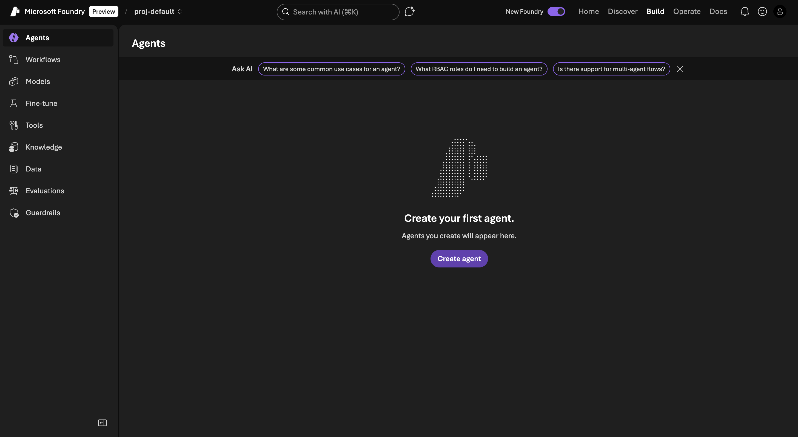

2. **Create New Agent**
   - Click the **+ Create agent** or **New agent** button.
   
   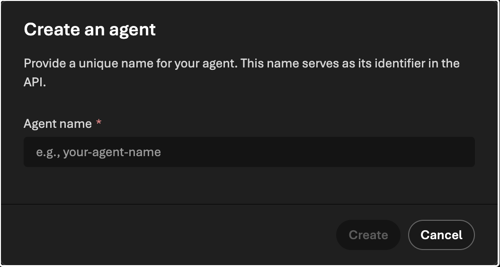

3. **Agent Configuration**
   ```
   Agent name: BasicAgent
   Model: gpt-5.1
   ```

   **Instructions Configuration**:
   ```
   You are an agent that answers questions.
   Use the most appropriate model based on the complexity and requirements of the request.
   Always provide clear, accurate, and helpful responses.
   ```
   
   Click the **Save** button to save.

   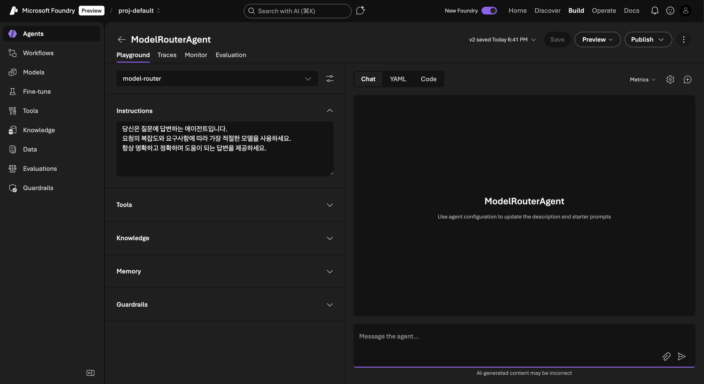

4. **Test Agent**

   **Test with these questions in the Chat tab:**

   ```
   User: Hello
   ```
   → Routes to a lightweight model for simple greetings

5. **Explore Additional Tabs**

   **YAML Tab**:
   - View agent configuration in YAML format
   - Manageable as Infrastructure as Code
   
   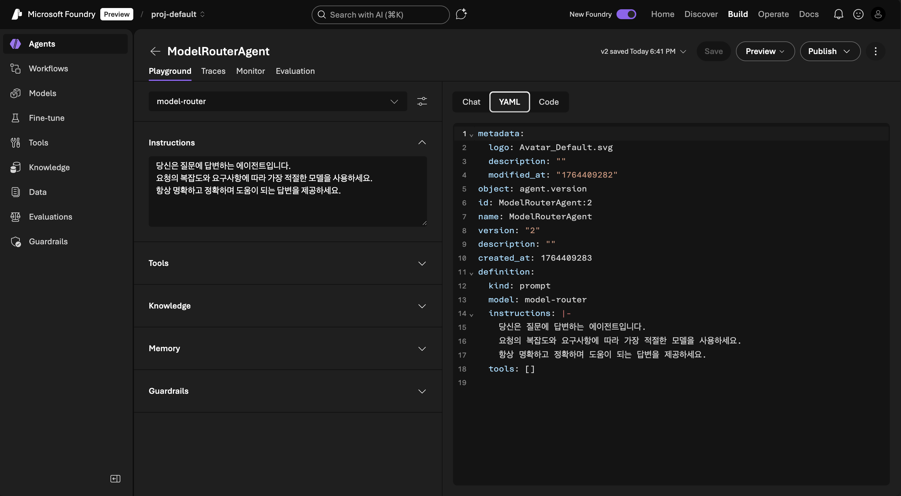
   
   **Code Tab**:
   - View samples for calling agent with code
   - Supports various languages: Python, JavaScript, C#, etc.
   
   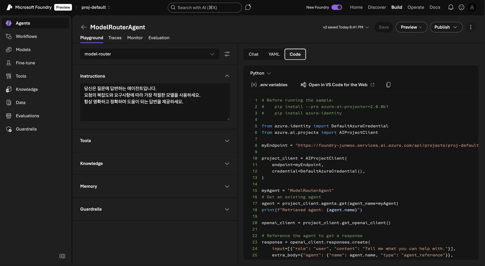

   **Traces Tab**:
   - Track agent execution process
   - Verify model selection decisions
   - Analyze performance and costs

   **Enable Tracing** please connected to existing 
   **Agent tracing** is only available in **Sweden Central** in Foundry (new).
   
   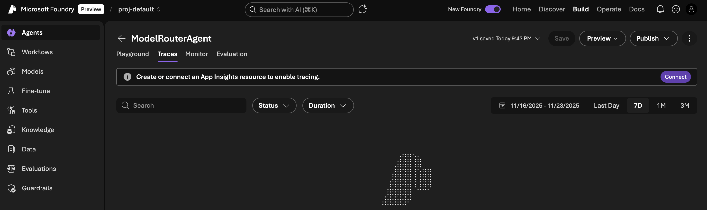

   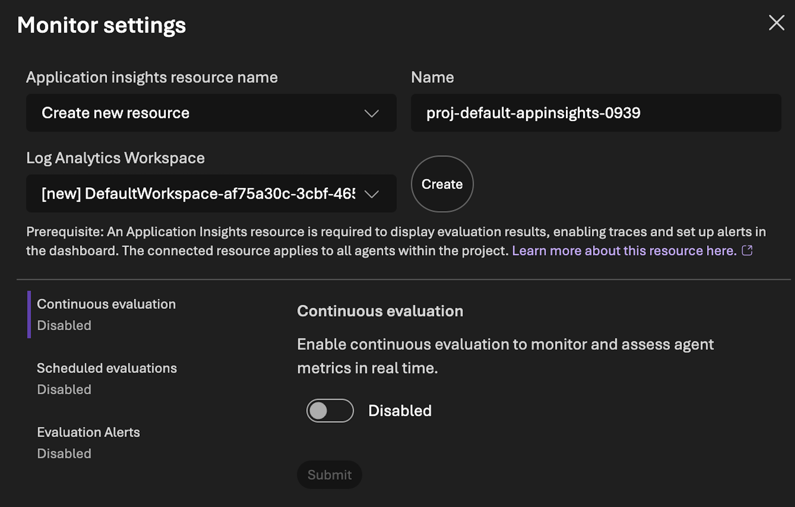

   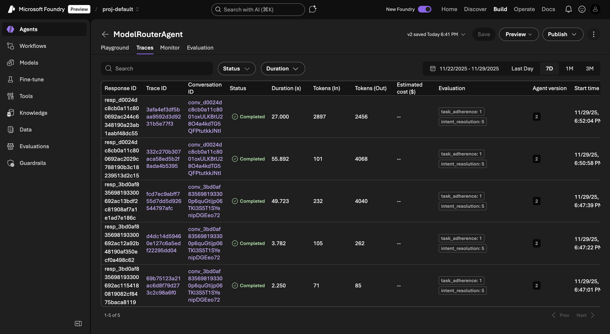

   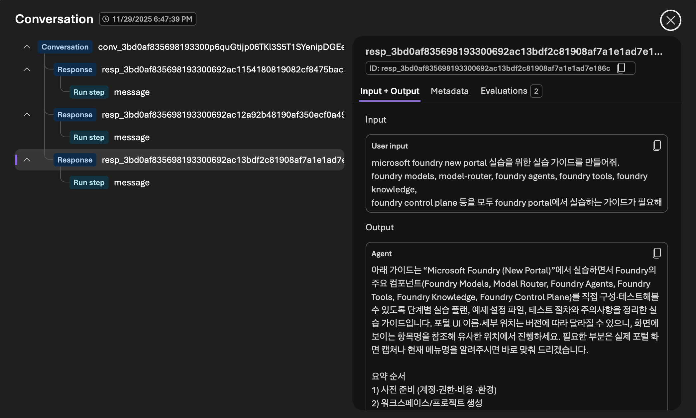


6. **Save Agent**
   - Click the **Save** button to save the agent.


## Create FileSearchAgent

Create an agent that finds information from uploaded documents using file search functionality.


1. **Create New Agent**
   ```
   Agent name: FileSearchAgent
   Model: gpt-5.1
   ```

2. **Instructions Configuration**

   Enter the following in the **Instructions** section of Playground:
   ```
   You are an agent that responds based on File search registered in Tools.
   
   Important rules:
   1. Only answer based on uploaded file content
   2. If information is not in files, respond "I cannot find that information in the provided documents"
   3. Mention source file name in responses
   4. Use accurate citations
   ```
   
   Click the **Save** button to save.

   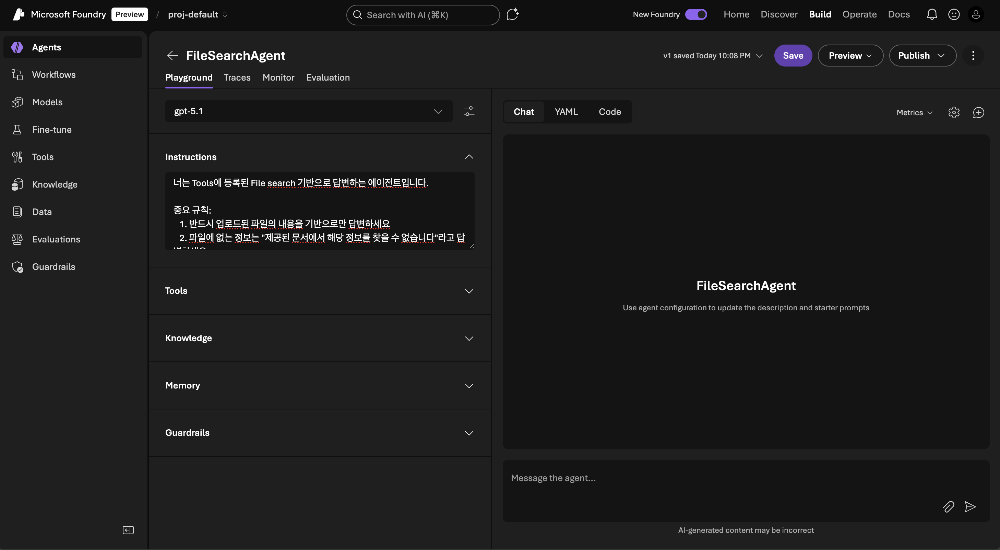

3. **Add File Search Tool**

   - Click the **+ Add** button in the **Tools** section.
   
   - Select the **File Search** option.
   - Verify File Search is added to Tools list.
   
   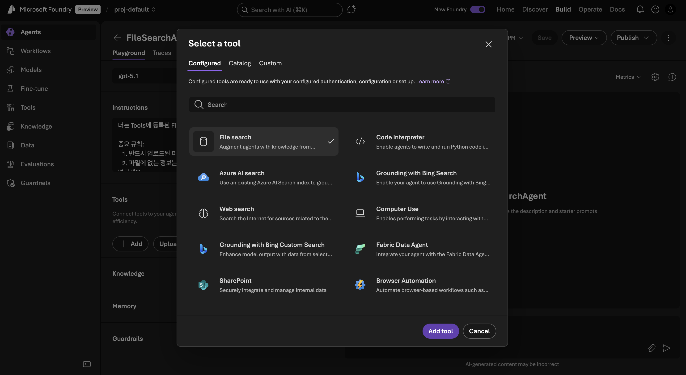

4. **Upload Files**

   - Click the **Attach files** button in the **Tools > File Search** section.
   
   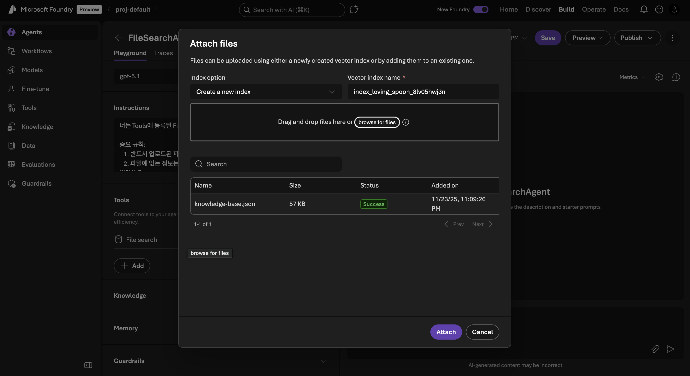
   
   - Upload the `thai_leave_policy` file.
   - Verify file uploaded successfully.
   
   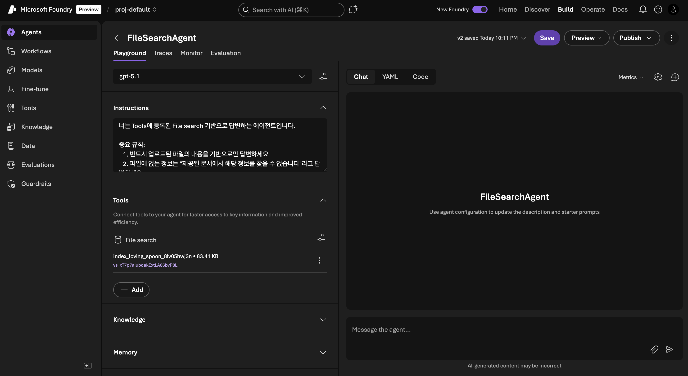

5. **Save Agent**
   - Click the **Save** button.

6. **Test Agent**

   **Test with these questions in the Chat tab:**

   ```
   User: พนักงานหญิงลาคลอดได้กี่วัน
   ```
   ```
   User: พนักงานลาป่วยได้กี่วัน
   ```
   
   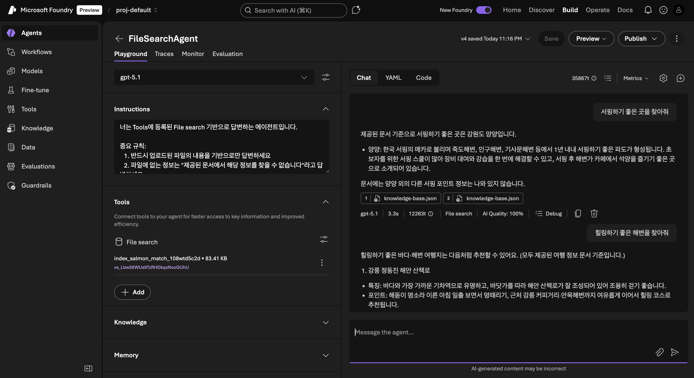

7. **Check Traces**

   - Check how File Search worked in the **Traces** tab.
   - You can view searched document chunks and relevance scores.
   
   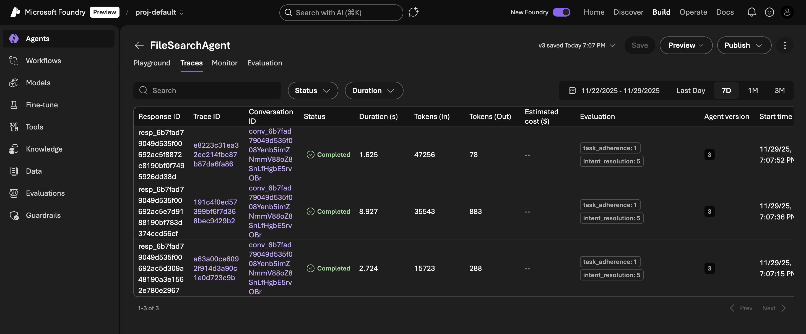

   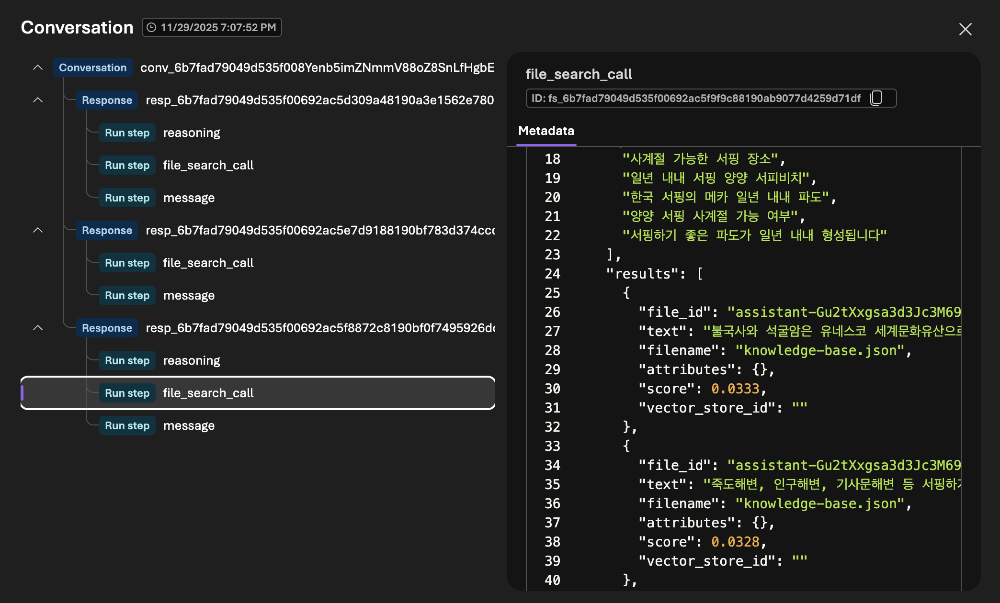

---


---