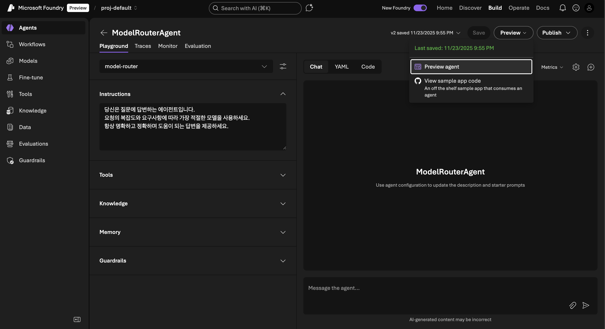
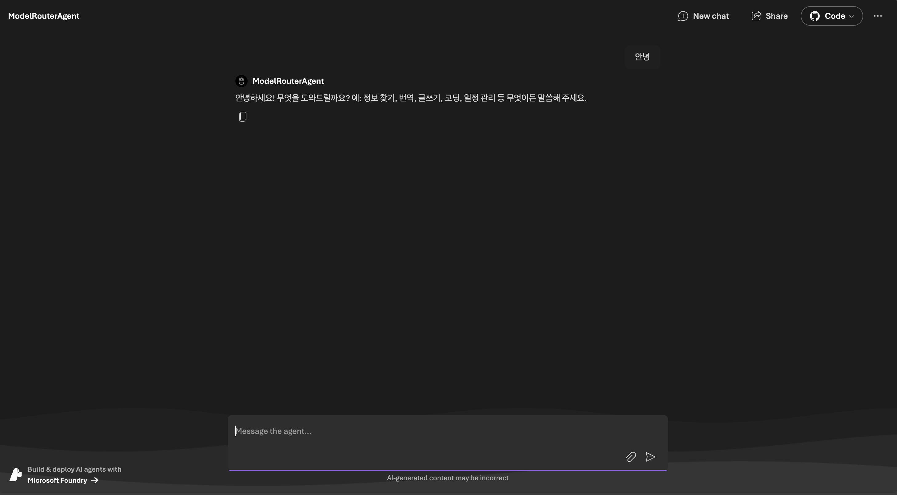
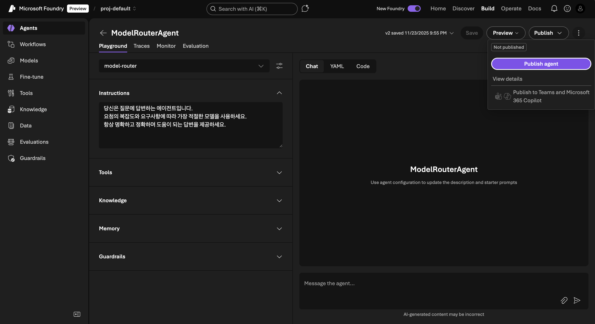
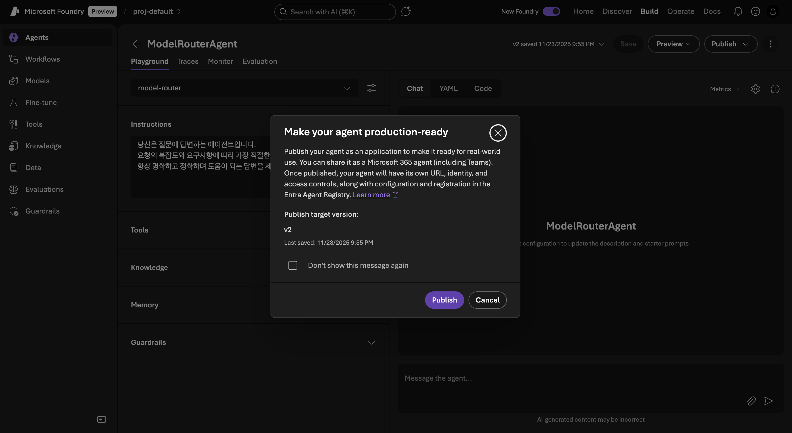
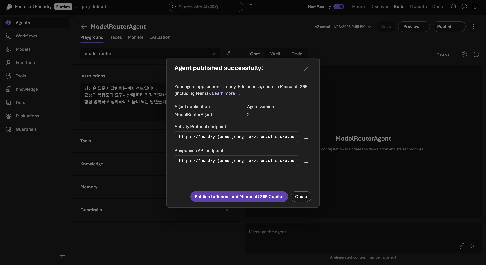
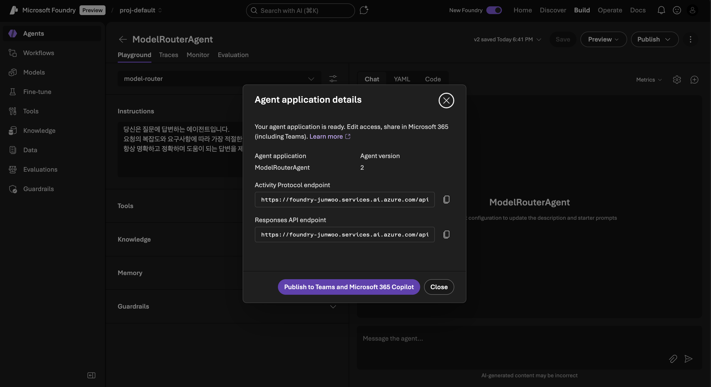

## Deploy and Invoke Agents

Learn how to deploy created agents and invoke them externally.

### Publish

1. **Preview Stage**

   - Click the **Preview** button in Playground.
   - You can check the following options:
     - **Preview agent**: Preview agent with web interface
     - **View sample app code**: Check sample application code
   
   

   

2. **Execute Publish**

   - Click the **Publish agent** button.
   
   

   - Click the **Publish** button.
   
   
   
   - Verify publish settings:
     ```
     Version: 1.0
     Status: Published
     Endpoint: [Auto-generated endpoint]
     ```
   
   

### Invoking Agents

#### 1. Azure CLI Login

First log in to Azure:

```bash
az login 
```

If using multi-tenant, specify tenant ID:
```bash
az login --tenant <tenant-id>
```

#### 2. Invoke Using Python SDK

> 💡 **Practice Tip**: The code below is for reference. During practice, open the `invokeAgent.py` file in the root path of this repository, modify `FOUNDRY_ENDPOINT` and `AGENT_NAME` values for your environment, then execute.

Example `invokeAgent.py` file:

```python
# Microsoft Foundry Agent Invocation using Activity Protocol
from openai import OpenAI
from azure.identity import DefaultAzureCredential, get_bearer_token_provider

# TODO: Update these values with your actual Microsoft Foundry details
# Get these from: https://ai.azure.com → Your Project → Deployments
FOUNDRY_ENDPOINT = "https://<foundry-resource-name>.services.ai.azure.com/api/projects/<project-name>"
AGENT_NAME = "ModelRouterAgent"  # Name of agent to invoke
API_VERSION = "2025-11-15-preview"

# Create OpenAI client with Azure authentication
client = OpenAI(
    api_key=get_bearer_token_provider(
        DefaultAzureCredential(), 
        "https://ai.azure.com/.default"
    ),
    base_url=f"{FOUNDRY_ENDPOINT}/applications/{AGENT_NAME}/protocols/openai",
    default_query={"api-version": API_VERSION}
)

try:
    # Call the agent using responses API
    response = client.responses.create(
        input="Recommend a 2 night 3 day travel itinerary for Jeju Island"
    )
    
    print(f"Response: {response.output_text}")
    
except Exception as e:
    print(f"Error: {e}")
    print("\n🔍 Troubleshooting:")
    print("1. Check your endpoint URL at https://ai.azure.com")
    print("2. Verify the project name and agent name exist")
    print("3. Ensure you're logged in: az login")
    print("4. Confirm the agent is deployed and running")
```

#### 3. Check Endpoint Information

How to check endpoint information in Foundry portal:

1. Select published agent in Build > Agents
2. Click **Publish** button, then click **View details**
3. Copy the following information:
   - Agent application
   - Activity Protocol endpoint
   - Response API endpoint



#### 4. Execute

```bash
# Create virtual environment (optional)
python -m venv .venv
source .venv/bin/activate  # Windows: venv\Scripts\activate

# Install required packages (including pre-release version)
pip install openai azure-identity
pip install --pre azure-ai-projects

# Run script
python invokeAgent.py
```

### 🔐 Authentication Options

#### Option 1: DefaultAzureCredential (Recommended)
```python
from azure.identity import DefaultAzureCredential
credential = DefaultAzureCredential()
```

#### Option 2: Managed Identity (When running on Azure resources)
```python
from azure.identity import ManagedIdentityCredential
credential = ManagedIdentityCredential()
```

#### Option 3: Service Principal
```python
from azure.identity import ClientSecretCredential
credential = ClientSecretCredential(
    tenant_id="YOUR_TENANT_ID",
    client_id="YOUR_CLIENT_ID",
    client_secret="YOUR_CLIENT_SECRET"
)
```

## 📚 Additional Resources

- [Microsoft Foundry Agents Overview](https://learn.microsoft.com/en-us/azure/ai-foundry/agents/overview?view=foundry)
- [Agent SDK Documentation](https://learn.microsoft.com/en-us/azure/ai-foundry/how-to/develop/sdk-overview?view=foundry&pivots=programming-language-python)
- [File Search Guide](https://learn.microsoft.com/en-us/azure/ai-foundry/agents/how-to/tools/file-search?view=foundry&pivots=python)
- [Web Search Integration](https://learn.microsoft.com/en-us/azure/ai-foundry/agents/how-to/tools/web-search?view=foundry&pivots=python)