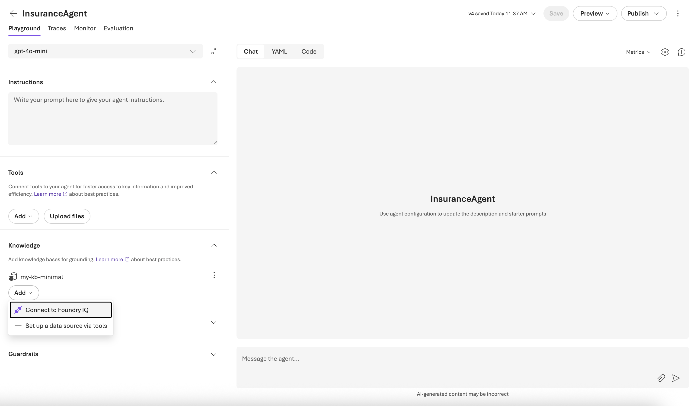
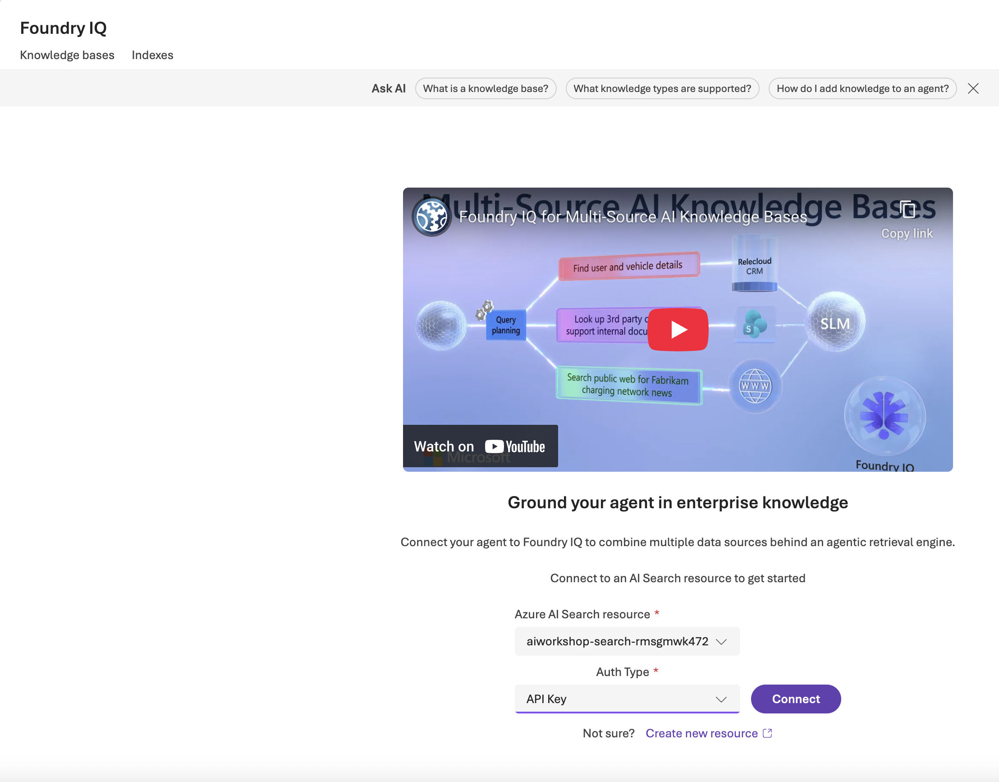
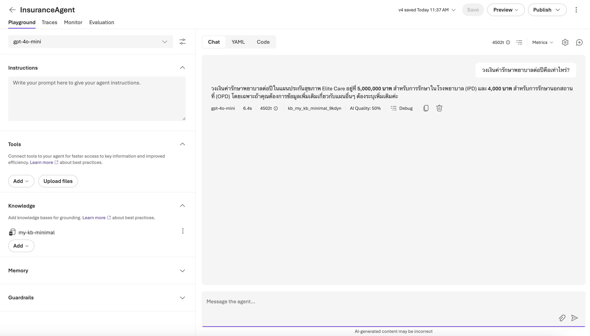
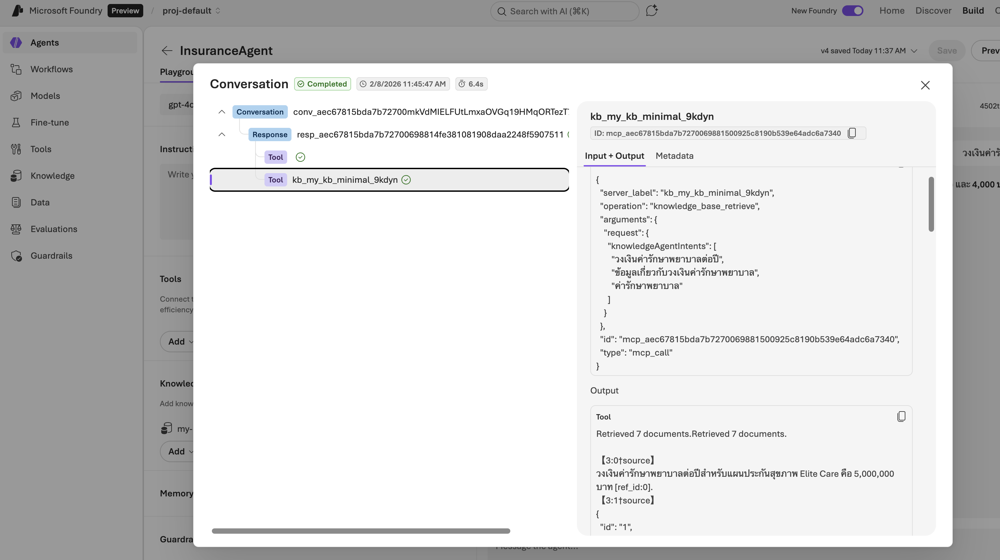

1. Please create an Agent in Foundry Portal Called "Insurance Agent" and choose "gpt-5-mini"
2. Please connect to the Foundry IQ Knowledge base we have created earlier

2.2 Please add the following instruction to the agent: Please use the information from knowledge base to answer the user's query

3. Connect via. API Key

4. Choose the "my-kb-minimal" base and ask "วงเงินค่ารักษาพยาบาลต่อปีคือเท่าไหร่?"

5. Observe the tracing.

