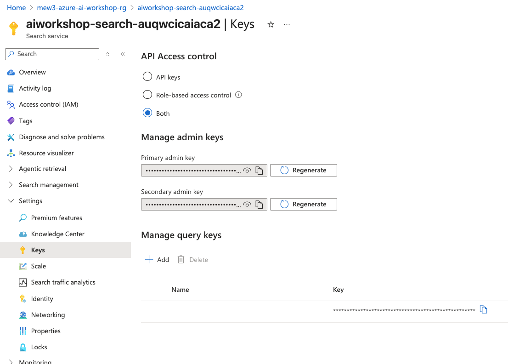
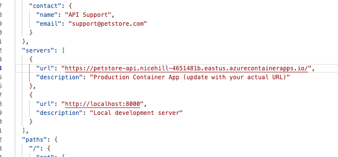
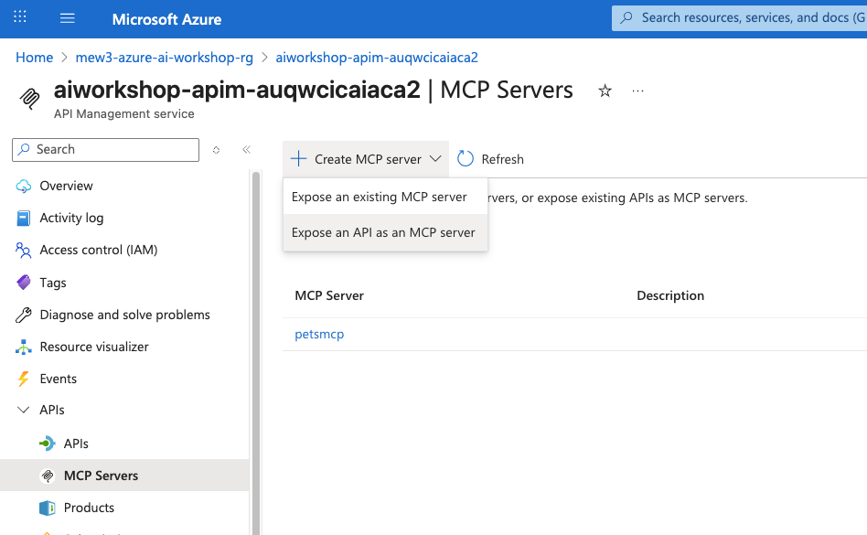

# TH Azure AI Workshop 2027

A comprehensive hands-on workshop for building AI agents with Azure AI Services, covering foundational concepts through advanced multi-agent workflows.

---

## Table of Contents

- [Python Environment Setup](#python-environment-setup)
- [Prerequisites](#prerequisites)
- [LAB 0: Setup & Infrastructure Deployment](#lab-0-setup--infrastructure-deployment)
- [LAB 1: Basic Agent](#lab-1-basic-agent)
- [LAB 2: AI Search & RAG](#lab-2-ai-search--rag)
- [LAB 3: Multi-Agent Workflow](#lab-3-multi-agent-workflow)
- [LAB 4: MCP & APIM](#lab-4-mcp-model-context-protocol--apim)
- [LAB 5: Evaluation](#lab-5-evaluation)
- [LAB 6: Observability](#lab-6-observability)
- [LAB 7: AI Services (Document Intelligence)](#lab-7-ai-services-document-intelligence)
- [Additional Resources](#additional-resources)

---

## Python Environment Setup

1. **Create a virtual environment**:
   ```bash
   python -m venv venv
   ```

2. **Activate the virtual environment**:
   - **Linux/Mac**:
     ```bash
     source venv/bin/activate
     ```
   - **Windows**:
     ```bash
     venv\Scripts\activate
     ```

3. **Install dependencies**:
   ```bash
   pip install -r requirements.txt
   ```

---

## Prerequisites

**Azure Permissions Required:**
- **Contributor** role
- **User Access Administrator** role

**Important Notes:**
- This lab has quota limits per Azure instance
- If you reach quota limits, switch to an alternative region (e.g., from `eastus` to `eastus2`)
- Update the region in both `LAB_0_setup/parameters.bicepparam` and `LAB_0_setup/deploy_api.sh`

---

## LAB 0: Setup & Infrastructure Deployment

### Step 1: Configure Resource Group

Please ensure you enable the following first:
```
az provider register --namespace Microsoft.CognitiveServices
az provider register --namespace Microsoft.Search
az provider register --namespace Microsoft.ApiManagement
az provider register --namespace Microsoft.ContainerRegistry
az provider register --namespace Microsoft.Insights
```

1. Navigate to `LAB_0_setup/` directory
2. Open `deploy_api.sh` and update the resource group name in line 25:
   ```bash
   # Example: mew3-azure-ai-workshop-rg → your-preferred-name
   ```

### Step 2: Deploy Azure Resources

Run the deployment script:
```bash
cd LAB_0_setup
bash deploy_api.sh
```

**Deployment time:** ~15 minutes

### Step 3: Set Up Python Environment

While waiting for deployment, set up your Python environment following the [Python Environment Setup](#python-environment-setup) section above.

### Step 4: Verify Deployment

After deployment completes, verify that the `.env` file in the root directory contains all environment variables.

### Step 5: Configure API Access Control

1. Navigate to Azure Portal
2. Locate your Azure AI Foundry resource
3. Set **API Access Control** to **'both'**



### Step 6: Hydrate Vector Index

Initialize the Azure AI Search vector index:
```bash
python LAB_0_setup/scripts/hydrating_vector_index.py
```

### Step 7: Test Search Index

Verify the search index is working:
```bash
cd LAB_0_setup/scripts/
python query_search_index.py
```

✅ **Setup Complete!** Your Azure AI infrastructure and vector database are ready.

---

### LAB 1: Basic Agent

Navigate to `LAB_1_basic_agent/` and run:
```bash
cd LAB_1_basic_agent/
python 03_azure_ai_basic.py
```

For more context, refer to [01_overview_foundry.md](LAB_1_basic_agent/01_overview_foundry.md) and [02_extra_notes.md](LAB_1_basic_agent/02_extra_notes.md).

---

### LAB 2: AI Search & RAG

This lab covers Azure AI Search fundamentals and Retrieval-Augmented Generation (RAG).

#### Lab 2.0: Search Fundamentals
```bash
cd LAB_2_AI_search/
python 00_search_fundamentals/search_fundamentals.py
```

#### Lab 2.1: Basic RAG
```bash
cd LAB_2_AI_search/01_basic_rag/
python azure_ai_with_search_context_semantic.py
```

#### Lab 2.2: Bonus - Agentic Retrieval
Navigate to `LAB_2_AI_search/02_bonus_agentic_retrieval/`:
- Follow the [README.md](LAB_2_AI_search/02_bonus_agentic_retrieval/README.md)
- Run indexing scripts in `indexing/01_minimal/` and `indexing/02_medium/` in order
- Test retrieval with query scripts

For better visualization: https://azure-ai-search-knowledge-retrieval.vercel.app/test

#### Lab 2.3: Foundry Portal
See [03_foundry_portal/README.md](LAB_2_AI_search/03_foundry_portal/README.md) for using Azure AI Foundry portal.

#### Lab 2.4: Bonus - Redis
```bash
cd LAB_2_AI_search/04_bonus/
python redis_basics.py
```

---

### LAB 3: Multi-Agent Workflow

Navigate to `LAB_3_multi_agent_workflow/`:

#### Lab 3.1: Sequential Agents
```bash
cd LAB_3_multi_agent_workflow/
python 01_sequential_agents.py
```

#### Lab 3.2: Handoff with Streamlit UI
```bash
cd LAB_3_multi_agent_workflow/
streamlit run 02_handoff_streamlit.py
```

#### Lab 3.3: Edge Conditions
```bash
python LAB_3_multi_agent_workflow/03_edge_condition.py
```

For more information, see [LAB_3_multi_agent_workflow/README.md](LAB_3_multi_agent_workflow/README.md).

---

### LAB 4: MCP (Model Context Protocol) & APIM

This lab covers MCP servers and Azure API Management integration.

#### Lab 4.1: Microsoft Learn MCP
```bash
cd LAB_4_MCP_APIM/
python 01_mslearn_mcp.py
```

#### Lab 4.2: Deploy Pets API Server

Navigate to `LAB_4_MCP_APIM/pets_api_server/` and update `deploy-to-azure.sh` with your resource group name:
```bash
cd LAB_4_MCP_APIM/pets_api_server
bash deploy-to-azure.sh
```

While waiting, test locally:
```bash
python LAB_4_MCP_APIM/02_api_to_mcp_agent.py
```

Once deployed, copy the Container App URL and update it in `openapi.json`.

#### Configure APIM:



A) Go to API Management instance → APIs tab → Upload your `openapi.json`. Tick "Subscription required."

B) Go to Products tab → Create a product using the registered API → Publish it.

C) Go to MCP server tab → Create an MCP server → Assign the created product.



D) Update `.env` with the MCP server URL and API key, then run:
```bash
cd LAB_4_MCP_APIM/
python 03_existing_mcp_agent.py
python 04_multiple_mcp_servers.py
```

#### Bonus: Math MCP Server
Deploy a custom MCP server:
```bash
cd LAB_4_MCP_APIM/maths_mcp_server
bash deploy-to-azure.sh
```

**Reference:** https://github.com/microsoft/agent-framework/blob/main/python/samples/getting_started/mcp/

---

### LAB 5: Evaluation

Navigate to `LAB_5_evaluation/` to learn about agent and model evaluation:

```bash
cd LAB_5_evaluation/
python 01_nlp_scores.py
python 02_ai_quality.py
python 03_safety.py
python 04_batch_evaluate.py
python 05_custom_evaluators.py
python 06_agentic_evaluation.py
```

---

### LAB 6: Observability

Learn about agent tracing and monitoring with Azure Application Insights:

```bash
cd LAB_6_observability/
python agent_with_foundry_tracing.py
```

---

### LAB 7: AI Services (Document Intelligence)

Explore Azure AI Document Intelligence for document analysis:

```bash
cd LAB_7_ai_services/
python sample_analyze_layout.py
```

---

## Additional Resources

- [Microsoft Agent Framework Documentation](https://github.com/microsoft/agent-framework/tree/main/python/samples/getting_started)
- [Azure AI Foundry Documentation](https://learn.microsoft.com/azure/ai-services/)
- [Azure AI Search Documentation](https://learn.microsoft.com/azure/search/)

